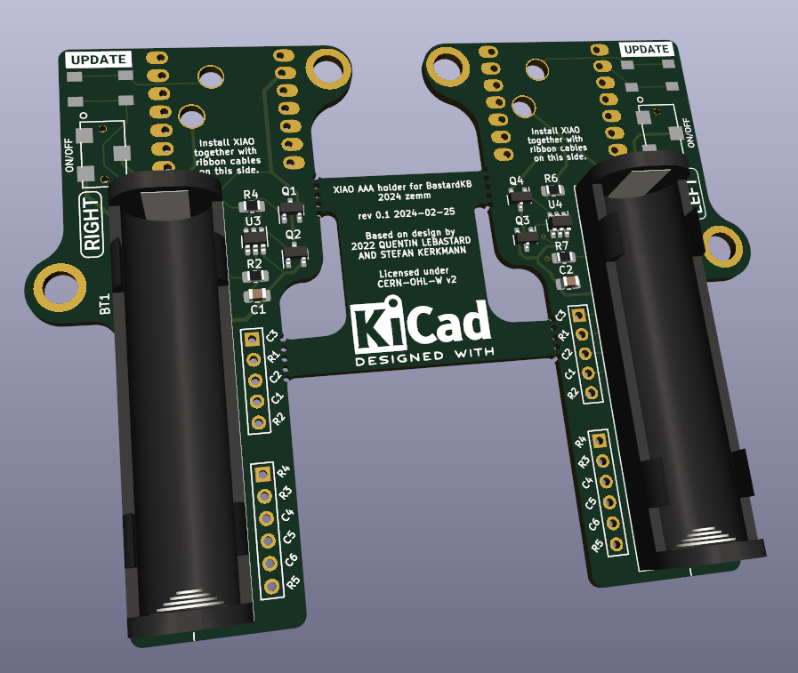

# WIP: not actually tested yet! (2024-02)

This **might not work** as it's **not tested yet**.

## XIAO BT AAA adapter for Bastard Keyboard Dactyls

Wireless XIAO Bluetooth holder PCB for Bastard Keyboards TBK Mini (maybe Skeletyl and Scylla).

Modified from the [original Elite-C-holder](https://github.com/Bastardkb/Elite-C-holder) by [Bastard Keyboards](https://bastardkb.com/), Quentin Lebastard and Alexander Krikun.

It encompasses an AAA battery holder for 3.7V 10440 Li-ion battery. As most of the 10440 Li-ions I found don't have protection circuits built in, I added a protection circuit for the battery based on the reference design of a [AP9101CAK6](https://www.mouser.fi/ProductDetail/621-AP9101CAK6BVTRG1) protection IC.

**I have no idea what I'm doing, so this is probably not safe and fine!**. Use at your own risk, or better yet, don't use at all. I claim no responsibility of any damage caused by this.

The original Elite C adapter supports Nice!nano and LiPO. Please consider using it instead.

## Removed features

I made this for my specific use case with my TBK mini, not as universal solution. As the XIOA has much less pins than the Elite C based MCUs, the features were heavily cut to a minimum.

I also don't generally use or need the removed features in wireless builds because of missing support or battery drain, although they would make more sense here with the added capacity of the 10440 battery. Maybe in a future revision?

It would be possible to have more pins and therefore retain the features by using a shift register (ZMK supports this), but at least for this first version, I was in a hurry and did not bother.

- Removed audio socket (wireless only).
- Removed RGB support.
- Removed Trackball support.
- Removed handedness resistor.

# License

CERN Open Hardware Licence Version 2 - Weakly Reciprocal
