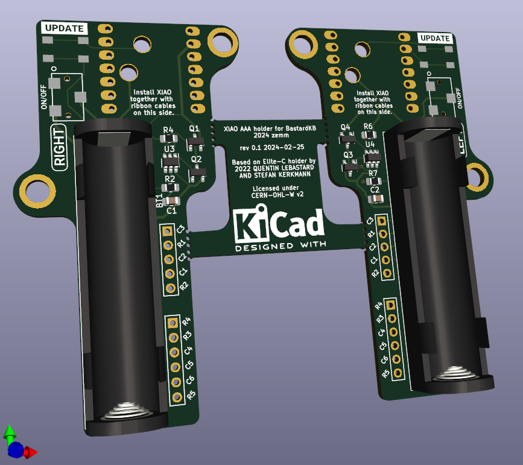

# XIAO BLE 10440 (AAA) adapter for Bastard Keyboard Dactyls

Wireless XIAO Bluetooth holder PCB for Bastard Keyboards TBK Mini and Skeletyl (not tested). Scylla should otherwise work too, but the power switch can't be operated.

Modified from the [original Elite-C-holder](https://github.com/Bastardkb/Elite-C-holder) by [Bastard Keyboards](https://bastardkb.com/), Quentin Lebastard and Alexander Krikun.

It encompasses an AAA battery holder for 3.7V 10440 Li-ion battery. As most of the 10440 Li-ions I found don't have protection circuits built in, I added a protection circuit for the battery based on the reference design of a [AP9101CAK6](https://www.mouser.fi/ProductDetail/621-AP9101CAK6BVTRG1) protection IC.

**I have no idea what I'm doing, so this is probably not safe and fine!**. Use at your own risk, or better yet, don't use at all. I claim no responsibility of any damage caused by this.

The original Elite C adapter supports Nice!nano and LiPO. Please consider using it instead.

The power switch is accessible through the open side of the TBK Mini and Skeletyl.

## Status

Initially tested as working.

## Firmware

[ZMK Module](https://github.com/zemm/zmk-config-bkd-xiao-ble).

## BOM & build info

[Schematic](xiao-ble-adapter-v0.1-schematic.pdf)

| Part              | Qty | Info    |
| ----------------- | --- | ------- |
| C 100n            | 2   | 0805    |
| R 330             | 2   | 0805    |
| R 2.7k            | 2   | 0805    |
| MCU               | 2   | I used Seeed Studio XIAO nRF52740, but nRF52840 probably works too.          |
| Battery holder    | 2   | [Keystone 2466 1xAAA](https://www.mouser.fi/ProductDetail/534-2466)          |
| Reset button      | 2   | Generic 4 pin SMD push button                                                |
| Power switch      | 2   | [Nidec CL-SB-12B-01T](https://www.mouser.fi/ProductDetail/229-CL-SB-12B-01T) |
| Protection IC     | 2   | SOT-23-6 AP9101CK6 variant. I used AP9101CAK6-BVTRG1 due to availability, but some other models had more suitable threshold values. |
| N-Channel MOSFET  | 4   | SOT-23 GSD. I used [SI2312CDS-T1-GE3](https://www.digikey.fi/fi/products/detail/vishay-siliconix/SI2312CDS-T1-GE3/2441583). |

As the XIAO is mounted flush with the adapter pcb, there are two through-holes for XIAO positive battery and reset connections. They are meant to be soldered from the connector to the plated side wall of the through-hole.

## Removed features

I made this for my specific use case with my TBK mini, not as universal solution. As the XIOA has much less pins than the Elite C based MCUs, the features were heavily cut to a minimum.

I also don't generally use or need the removed features in wireless builds because of missing support or battery drain, although they would make more sense here with the added capacity of the 10440 battery. Maybe in a future revision?

It would be possible to have more pins and therefore retain the features by using a shift register (ZMK supports this), but at least for this first version, I was in a hurry and did not bother.

- Removed audio socket (as ZMK and batteries are wireless only).
- Removed RGB support.
- Removed Trackball support.
- Removed handedness resistor.

## Future improvements

Things I'd like to change if doing it again.

- Find a toggle push button fitting through the unused audio socket hole to be used as the power switch.
- If still using the current slide power switch, swap it around so that "on" is facing away from you.
- Add RGB support either by dropping the row pin unused by TBK Mini and Skeletyl (dropping Scylla support) or by using a shift register for the matrix.
  - 10440 might have enough capacity for this to make some sense after all?
  - The leds have a minimum supply voltage of ~3.4V, how could that be handled?

# License

CERN Open Hardware Licence Version 2 - Weakly Reciprocal
